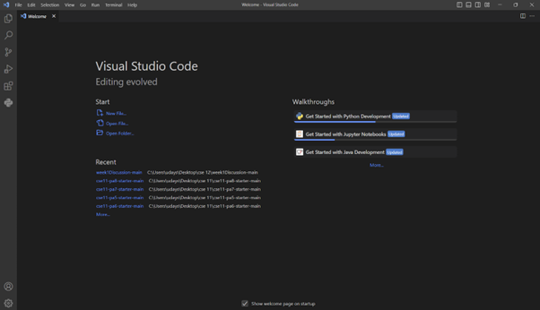
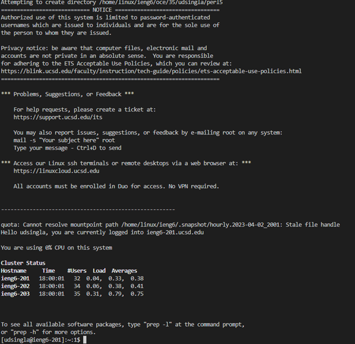
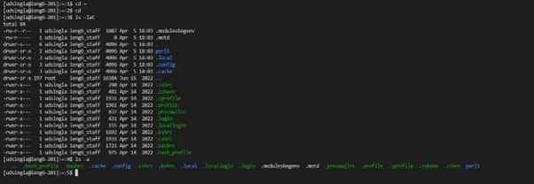

# Lab Report 1 - Remote Access and FileSystem
## How to login and access remote access on your computer

## Step 1: Installing VScode
Go to the [VScode website](https://code.visualstudio.com/) and follow the instrutions on the website ot download and install it on your device.

Once it is installed, you should be able to open a window that looks like below:

I had VScode already installed on my laptop so I could skip this step.

## Step 2: Remotely Connecting
If you are on Windows, you need to install `git` for Windows.
You can do that from [Git for Windows](https://gitforwindows.org/).

Once installed, use the steps in this post to set your default terminal
to use the newly-installed `git bash` in Visual Studio Code: \
[Using Bash on Windows in VScode](https://stackoverflow.com/a/50527994)

Then, to use `ssh`, open a terminal in VScode. (Ctrl or Command + \`, or use the Terminal → New Terminal menu option). Your command will look like this, but with the `zz` replaced by the letters in your course-specific account.

`$ ssh cs15lsp23zz@ieng6.ucsd.edu`

Since it is the first time connecting to the server, it asks about the authenticity of host. Type `yes` to connect to the server. However, if it is a server you connect to *often* and you still get this prompt then it means that someone else is trying to access the connection.

Give it your password, and after pressing enter you will be logged in.

The screen should look like: \

Now you are successfully connected to the server.

## Step 3: Trying some Commands
Try running the commands `cd`, `ls`, `pwd`, `mkdir`, and `cp` a few times in different ways, both on your computer, and on the remote computer after ssh-ing (use the terminal in VScode).

To log out of the remote server in your terminal, you can use:\ 
* Ctrl + D
* Run the command `exit`.

An example of running such commands is: \

