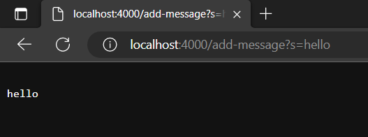
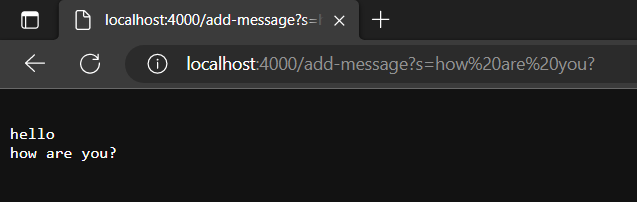

# Lab Report 2 - Servers and Bugs
## Part 1 - Creating StringServer
StringServer is a server which tracks a String and adds it to the incoming requests.

`StringServer.java` was made along with the already existing `Server.java` file which provides the interface URLHandler and also starts the Server where our website may run.

The code for `StringServer.java` is given below:

```
import java.io.IOException;
import java.net.URI;

class Handler implements URLHandler {
    String str = "";
    public String handleRequest(URI url){
        if (url.getPath().equals("/")){
            return str;
        }
        else if(url.getPath().contains("/add-message")){
            String[] input = url.getQuery().split("=");
            str = str + "\n" + input[1];
            return str;
        }
        else{return "404 Not Found";}
    }

}
    
class StringServer {
    public static void main(String[] args) throws IOException {
        if(args.length == 0){
            System.out.println("Missing port number! Try any number between 1024 to 49151");
            return;
        }

        int port = Integer.parseInt(args[0]);

        Server.start(port, new Handler());
    }
}
```

***


When the code is compiled and run with the port number in terminal, the port number is given as an argument to the main method of the StringServer class which starts a localhost server with the given port number.

This is when we have started the server and give it the first input in the URL to `add-message`:



When this URL is entered, the following take place:
1. The entire URL is given as an argument to the handleRequest method in the Handler class and the method is implemented.
2. As the method runs, it first checks the path of the URL by calling `.getPath()` on the url. Since it is not the same as `/`, the method moves on ignoring the if statement.
3. The value of variable `str` is still an empty String "".
4. On reaching the second if statement, the condition evaluates to 'true' as the path does indeed contain "/add-message".
5. The method then calls `.getQuery()` which returns the query of the url and the split method splits the string from `=` sign and stores them in the String array called `input`. 
6. `str` then gets updated by adding the String at index 1 of `input` which is the same as the text after the `=` sign in the url, i.e. "hello"
7. The method stops as the value of `str` is returned and gets displyed on the website.

##

Then we enter another URL with a different message at the end after `=`:



1. Again the same steps take place as the previous URL. 
2. Since the URL is new, it is given as a new argument to URLHandler method and all the variables inside the method get reset.
3. However the `str` value is already "hello" from the previous URL change since it was saved outside of the method.
4. Following the same steps as above, the method reaches to add the current String after `=` in the URL ("how are you?") to the existing `str`. It also adds `"\n"` to the string which makes it appear in a new line which is why 'how are you?' gets displayed in the line below 'hello' after the value of `str` is returned.
