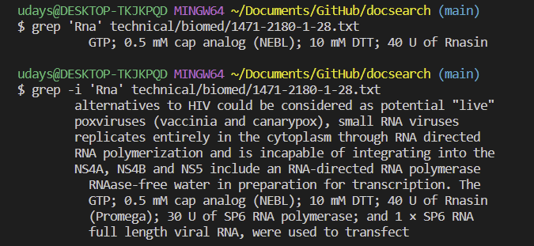

# Lab Report 3 - Researching Commands

I have chosen the command `grep` and researched command-line options for it.

Following are the command-line options that I found and decided to include in the lab report:
1. `-i` - The "-i" option in the grep command stands for "ignore case." When you use "-i" with grep, it makes the search case-insensitive, which means that the pattern or string you are searching for will match regardless of whether it is in upper case or lower case.

