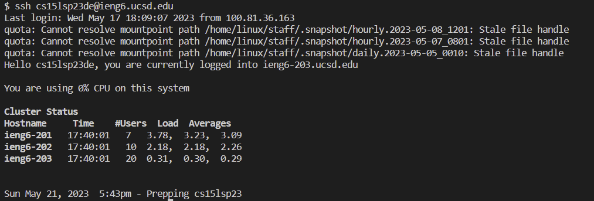
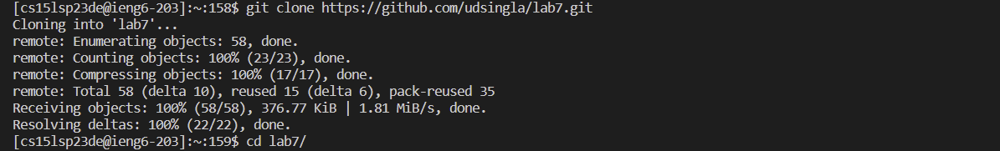
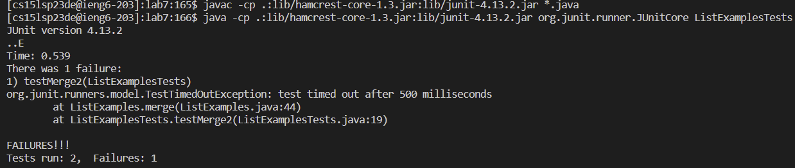
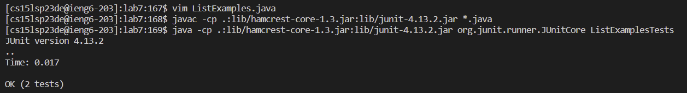
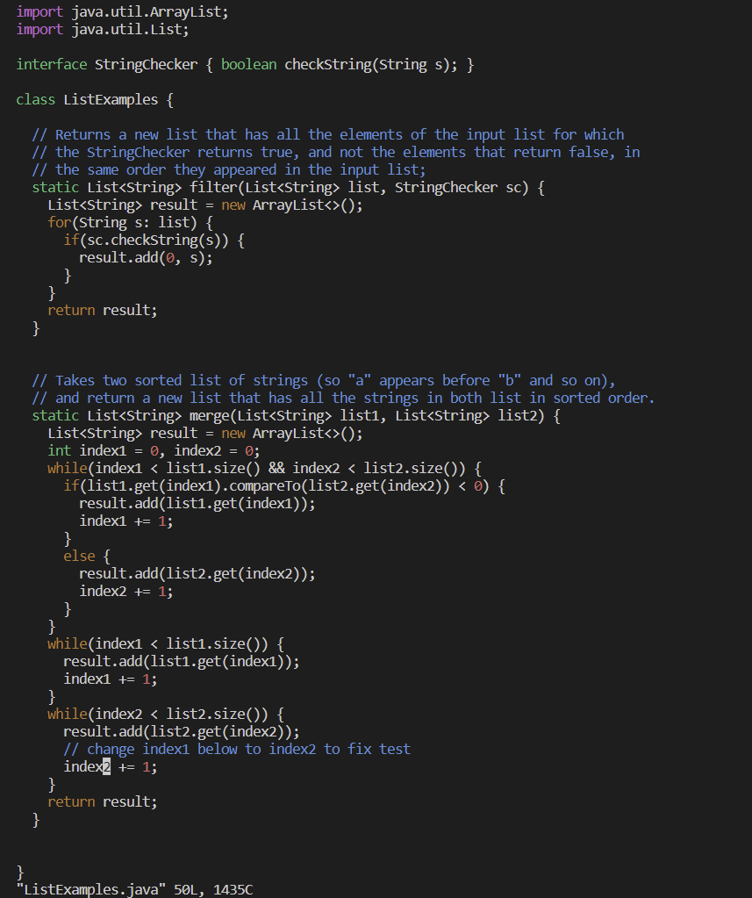
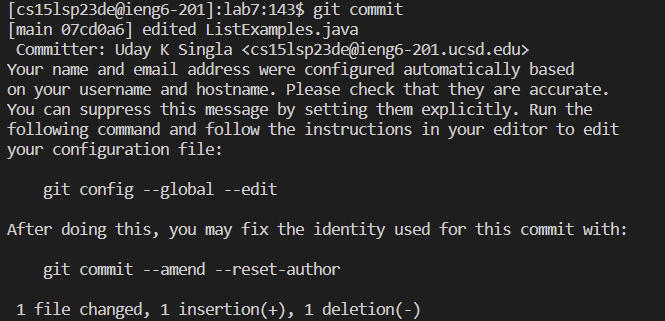
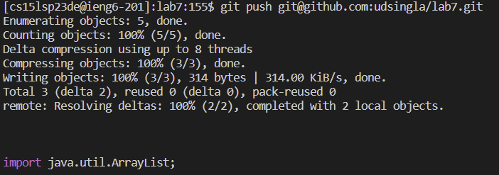

# Lab Report 4 - Doing it All From the Command Line

In this report we edit a file from the command line.
I will be writing the keystrokes I pressed to achieve the goal.

## Step 1: Log In to ieng6:
### keystrokes:
* ssh cs15lsp23de@ieng6.ucsd.edu `<enter>` \
 (I did not need password as I set up the SSH key for ieng6)

### screenshot:

## Step 2: Clone your fork of the repository from your Github account
### keystrokes:
* git clone `<paste>` `<enter>` \
(I copy and pasted https://github.com/udsingla/lab7.git from github)
* cd l `<tab> <enter>` \
this autofills to lab7 and shifted me into the lab7 directory which just got cloned.

### screenshot:

## Step 3: Run the tests, demonstrating that they fail
### keystrokes:
* `<up><up><up><up><up><up><up><up><up><up><enter> javac -cp .:lib/hamcrest-core-1.3.jar:lib/junit-4.13.2.jar *.java` 
* `<up><up><up><up><up><up><up><up><up><up><enter> java -cp .:lib/hamcrest-core-1.3.jar:lib/junit-4.13.2.jar org.junit.runner.JUnitCore ListExamplesTests` \
(They were 11 spaces above in the terminal from my practice run before) \
It compiled the java files and ran the tests.

### screenshot:

## Step 4: Edit the code file to fix the failing test
### keystrokes:
* vim L `<tab>`.j `<tab> <enter>` (autofills to 'vim ListExamples.java' and opens ListExamples.java in vim)
* /change `<enter><down><right><right>` (Searches for word change and then we navigate to the desired place)
* r2 (replaces 1 with 2)
* :wq (saves file and quits vim)

### screenshots:

(Ignore the java tests in the above screenshot, they will be relevent in the next step.)

 \
(view when we open the file using vim and after changing index 1 to 2 which is highlighted by cursor)

## Step 5: Run the tests, demonstrating that they now succeed
### keystrokes:
* `<up> <up> <up> <enter>(javac -cp .:lib/hamcrest-core-1.3.jar:lib/junit-4.13.2.jar *.java)` 
* `<up> <up> <up> <enter>(java -cp .:lib/hamcrest-core-1.3.jar:lib/junit-4.13.2.jar org.junit.runner.JUnitCore ListExamplesTests)` \
It was 3 places up in the terminal \
It compiled the java files and ran the tests.

### screenshots:

## Step 6: Commit and push the resulting change to your Github account
### keystrokes:
* git add ListExamples.java `<enter>`
* git commit `<enter>`
* i (to get into insert mode for commit message)
* edited ListExamples.java
* `<esc>` :wq (exit insert mode, save and enter commit message and confirm commit)
* git push git@github.com:udsingla/lab7.git `<enter>` (push to github)

### screenshots:

***
