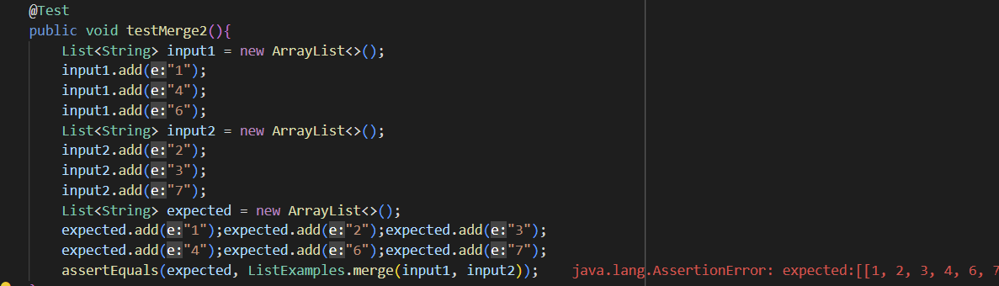

# Lab Report 5 

## Part 1 - Debugging Scenario

In this report we make a setup of a edstem doubt by a student of a wrong output of their code and act as TAs to identify the error and suggest things that the student can try.

### 1) Uploaded post by student 

**Q - What environment are you using (computer, operating system, web browser, terminal/editor, and so on)?** \
A - Windows Laptop, VS Code terminal

**Q - Detail the symptom you're seeing. Be specific; include both what you're seeing and what you expected to see instead. Screenshots are great, copy-pasted terminal output is also great. Avoid saying “it doesn't work”.** \
A - I am failing a test in ListTests.java for ListExamples from week 3 lab (slightly modified). I ran the tests with a bash script and I am testing the merge function and the output says the expected value was [1, 2, 3, 4, 5, 7] but the actual it got was [1, 2, 3, 4, 5, 5]. I can't seem to figure out where the last element 5 came from when it is supposed to be 7. I am adding screenshots of my terminal and my tests.

**Q - Detail the failure-inducing input and context. That might mean any or all of the command you're running, a test case, command-line arguments, working directory, even the last few commands you ran. Do your best to provide as much context as you can.** \
A - I am inputting list1 = [1, 4, 5]  and list2 = [2, 3, 7] and calling the merge function on it. I expect to see final list [1, 2, 3, 4, 5, 7] but I am getting [1, 2, 3, 4, 5, 5].

***

### 2) TA's reply:

Seeing the bash script and test file, they look fine. When the test fails, the last element 5 after the merge might be the last element of the first list added in testMerge2. Try changing the number 5 in the first list to some other number to see what you get. You might be adding elements of the first list in a part when you are meant to be adding elements of the second list.

***

### 3) Result of student trying the given suggestion

I changed the last element of the first list to 6 instead of 5 and after running the test I got the last two elements as 6, 6 this time instead of 5, 5 as before. I looked through my code and found the error where I indeed was adding elements from list 1 while iterating over list 2. I fixed it and now my code works properly.

**Changed Test -**

**Changed Output -** \

**Identification of Bug -** \
 

To correct it we can just write `list2.get(index2)` instead of `list1.get(index2)`. 

**Corrected code -** \

***

### 4) All information required for setup:

Bash script and terminal error output:

Tester File:

ListExamples.java:

File Structure: \

**Command I used in terminal for error-**
`bash grader.sh`

**To fix the bug -**
We change `list1.get(index2)` to `list2.get(index2)` in ListExamples.java line 26

This results in adding elements from list 2 when the elements of list 1 are over and we only need to copy remaining elements of list 2.

**Bug -** \

**Corrected code -** \

***

## Part 2 - Reflection
One thing that I learned in the second half of the course was writing bash scripts which led me to make autograder like scripts to run the tests on its own and check for any missing files and report the errors accordingly. It was really interesting to learn how it works and get an idea of how a tool runs which I have been using since the last 3 quarters for various CSE courses.
